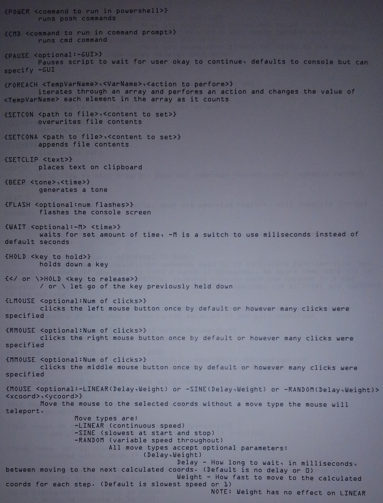
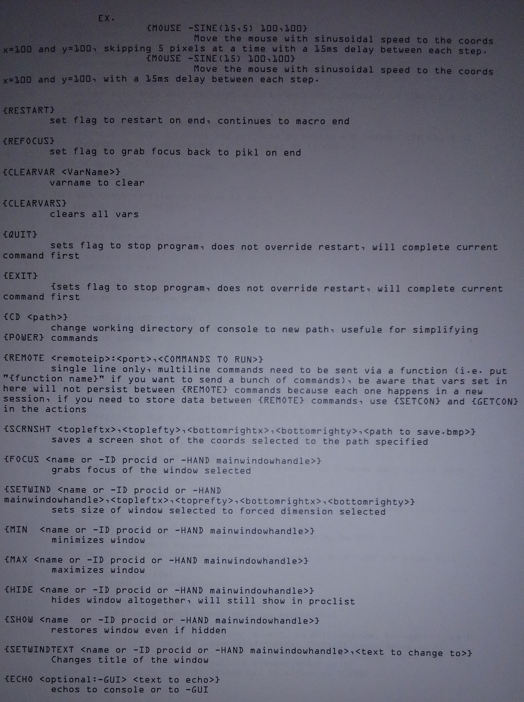

F1 = insert block comment start

F2 = insert block comment end

F3 = toggle comment for the selected line

F4 = on the commands tab, inserts an IF/ELSE statement
     on the functions tab, inserts a new function

F5 = Run the program

F6 = insert the current mouse coordinates as a command
     (i.e. insert a command to move the mouse to the current coords)

F7 = insert a wait 100 milliseconds command

F8 = Run only the highlighted commands

F9 = N/A

F10 = Highlight the detected syntax

F11 = Save the program, if a profile is loaded

F12 = N/A

Notes:

Tab can be used to tab in or out multiple selected lines
Ctrl+s will save as well

Right Click will bring up a custom menu with things like find/replace

